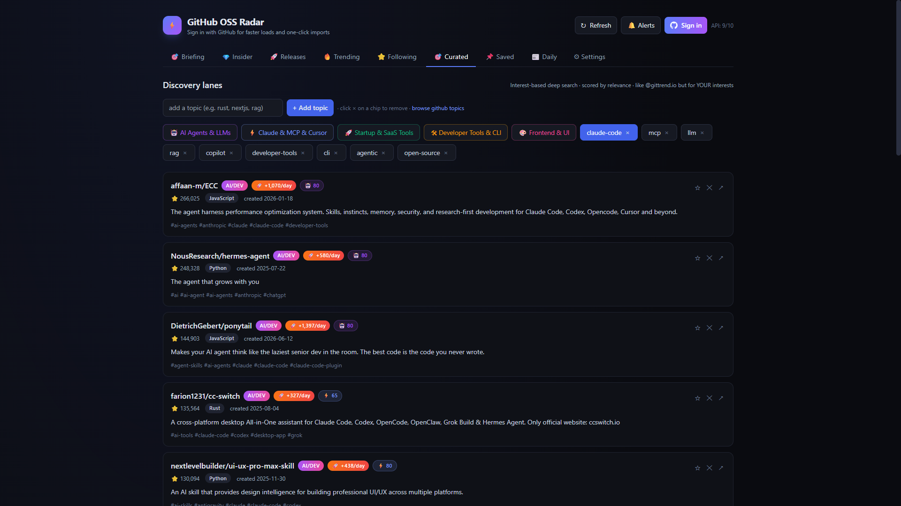
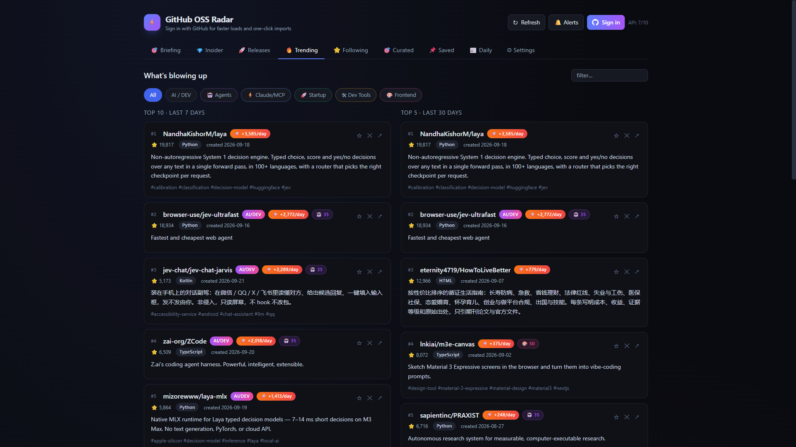

<p align="center">
  <a href="https://albinthomas710-hub.github.io/github-oss-radar/app/">
    
  </a>
</p>

<h1 align="center">GitHub OSS Radar</h1>

<p align="center">
  Find the GitHub repos worth your time.<br>
  Interest lanes. Insider stars. A stash that learns what you keep.
</p>

<p align="center">
  <a href="https://albinthomas710-hub.github.io/github-oss-radar/app/"><strong>Open the live app</strong></a>
  &nbsp;·&nbsp;
  <a href="https://github.com/albinthomas710-hub/github-oss-radar">Source</a>
  &nbsp;·&nbsp;
  <a href="#every-tab">How it works</a>
</p>

<p align="center">
  
  
  
  
</p>

One HTML file. No install, no server, no account required to try it. GitHub’s public API is free. A token with no scopes raises the limit from 60 requests an hour to 5,000, and that token never leaves your browser except to call `api.github.com`.

<p align="center">
  
</p>

The good repos are public on GitHub before anyone posts a screenshot of them. This page is the filter: what is moving, what people you trust just starred, and what matches the lanes you actually care about. Save the gold. Hide the rest. Come back tomorrow and the taste model has shifted.

| | | |
|---|---|---|
| **Interest lanes** | Five built-in searches for agents, Claude and MCP, startups, dev tools, and frontend. Each repo gets a relevance score. | Add your own topics. |
| **Insider stars** | See what the people you follow starred in the last 21 days. Two or more of them on the same repo is marked as a gem. | That is the signal curators are late to. |
| **Velocity** | Stars divided by the age of the repo. A new repo moving fast ranks above an old repo with the same star count. | Trending is not “most stars ever.” |
| **Taste** | Saving boosts those topics and languages. Hiding demotes them. The next briefing prefers what you have already kept. | Your stash is the training set. |
| **Local forever** | Follows, saves, topics, and the token live in the browser. Export them as JSON. There is no account to lose. | Reset does not touch GitHub. |

---

## The problem it solves

GitHub is where real tools show up first. A strong repo is public for days before a curator posts a screenshot of it. The trouble is the firehose. Trending is full of one-week toys. Search returns thousands of half-dead repos. Following fifty people means fifty profile pages.

OSS Radar does four jobs at once:

1. It watches what is new and what is moving fast.
2. It watches what specific people star.
3. It searches fixed interest lanes with several queries each, then scores the results.
4. It remembers what you save and what you dismiss, and uses that the next time you open it.

Gold is a repo you would actually clone, read, or ship with. Everything else is noise. The app is built to separate those two.

---

## Open it

| Way | What to do |
|---|---|
| Browser, no install | Open the [live app](https://albinthomas710-hub.github.io/github-oss-radar/app/) |
| This machine | Clone the repo and open `app/index.html` |
| Windows | Double-click `app/launch.bat` |

Chrome, Edge, and Firefox all work. Closing the tab stops the app. Nothing keeps running in the background.

Sign-in is optional. Without a token, GitHub allows about **60 API requests per hour**. With a token, that rises to **5,000 per hour**. Public repository data needs **no scopes**.

Create one here: https://github.com/settings/tokens?type=beta

Paste it in **Sign in**, or in **Settings**. It is stored in `localStorage` on that browser profile. Sign out with the **⎋** button next to your avatar. A dead or expired token returns 401, the app clears it, and it asks you to sign in again.

If you already use the GitHub CLI, you can sign in from a terminal:

```powershell
cd app
python login.py
```

`login.py` needs Python 3 and [`gh`](https://cli.github.com). It reuses `gh auth token` when you are already logged in, or runs `gh auth login`. For about two minutes it serves that token on `http://127.0.0.1:8765/token` so the page can pick it up. Then the local server stops. On Windows, `app/login.bat` does the same thing.

---

## A normal day

1. Open **Briefing** and click **Build briefing**.
2. Read the top pick, the two repos worth a click, and the lane sections.
3. Star-save anything you might use. Hide anything that is junk.
4. If a person keeps showing up, follow them on the **Following** tab.
5. Once a week, open **Saved**, put repos into your own topics, and actually use one.

That is the product. The other tabs exist when you want to go deeper.

---

## Every tab

### Briefing

One screen for today. **Build briefing** loads trending, insider stars, and releases, then ranks unsaved repos.

The top card is **Must see today**. Under it, **Worth a click** shows the next two. Then each interest lane that has a strong match lists up to three repos with a relevance score. **From your watch list** shows up to three releases from the last 30 days.

A repo scores higher when several people you follow starred it, when its star velocity is high, when it matches topics and languages you have saved before, and when it looks like an AI or developer tool. Repos you already saved are left out of the picks so the page stays about what is new.

### Insider

This is the tab for spying on taste, legally. For each account you follow, the app reads their recent stars and keeps stars from the **last 21 days**.

- **💎 N× insider** means at least two of the people you follow starred that same repo.
- A single star still shows, with who starred it and how long ago.
- Stars on repos owned by someone already in your follow list are skipped, so the feed is not just their own work.
- Avatars show who starred it. Hover a face for the handle and the time.
- Results are cached for **6 hours** so a refresh does not burn the API. **Refresh** in the header forces a new pull.
- The list is capped at 40 cards, sorted by how many insiders starred it, then by the newest star.

Follow better people and this tab gets better. The default list is a starting set, not a prescription.

### Releases

New GitHub releases from the **last 30 days**, taken from:

- every repo in your stash
- up to 25 recent repos from people you follow
- up to 15 insider repos

Each card shows the tag, whether it is a pre-release, the publish time, and the first part of the release notes. Open the release or the repo from the card. Hide a repo if you do not care about its releases anymore.

This list is cached for **3 hours**. If the pool is empty, open Following or save a few repos first so the radar has something to check.

### Trending

Two columns:

- **Last 7 days.** New repos created in the last week, merged with established repos (more than 500 stars) that were pushed in the last week. Duplicates are removed. The merged list is sorted by a blend of velocity, your taste score, and the best interest-lane score, then cut to 15.
- **Last 30 days.** Repos created in the last month, sorted by stars on GitHub’s side, then re-ordered in the app when you filter.

Filters across the top:

| Filter | What it keeps |
|---|---|
| All | Everything that is not hidden |
| AI / DEV | Repos whose name, description, or topics hit the AI and developer keyword list |
| Agents, Claude/MCP, Startup, Dev Tools, Frontend | Repos that score at least 15 on that interest lane, best match first |
| The search box | A plain text filter over name, description, and topics |

Taste matches float upward inside a filter. Hidden repos never appear.

### Following

People worth watching.

- Type two or more letters. The app searches GitHub users and orgs and shows avatars. Arrow keys and Enter work. Click a row to follow.
- **Import my GitHub follows** pulls the accounts you follow on GitHub (up to 500) and adds the ones you do not already track.
- Each person is a card with name, handle, bio, and an unfollow button.
- Below the cards, **Recent repos** are repositories those people pushed in the **last 90 days**. Follows are queried in batches of five. A repo created in the last 7 days can show a **NEW** badge once the app has seen that person before.
- If browser notifications are allowed, a new repo from someone you follow can raise a desktop alert. Click **Alerts** in the header once to grant permission. At most three alerts fire per refresh.
- While you are signed in and the tab is visible, this list also refreshes about every **30 minutes**.

The first run ships with these follows already in the list: `karpathy`, `simonw`, `ggerganov`, `jeremyhoward`, `swyxio`, `anthropics`, `openai`, `huggingface`, `langchain-ai`, `vercel`, `microsoft`, `google-deepmind`. Delete any of them. Add whoever you actually learn from.

### Curated

Discovery lanes. This is the deep search, not the front-page firehose.

Five lanes are built in. You cannot delete those chips. You can add your own GitHub topics, and you can remove those.

Each built-in lane runs **three** GitHub searches over the last **90 days**, merges the results, drops duplicates, and sorts by a relevance score from 0 to 100. A badge appears when that score is 40 or higher.

| Lane | What the searches look for |
|---|---|
| AI Agents & LLMs | `ai-agents`, agent and LLM phrases, LangChain, AutoGPT, CrewAI |
| Claude & MCP & Cursor | Claude Code, MCP, Cursor, model context protocol, Anthropic |
| Startup & SaaS Tools | SaaS, boilerplates, starter kits, indie hacker, MVP, landing pages |
| Developer Tools & CLI | Developer tools, CLIs, productivity, devtools |
| Frontend & UI | UI components, design systems, React, Next.js, Tailwind, component libraries |

A custom topic chip runs one search: `topic:<your-topic>` pushed in the last 90 days, sorted by stars. Topic names are lowercased and spaces become hyphens. [GitHub’s topic list](https://github.com/topics) is the catalog those chips map to.

The default custom topics are `claude-code`, `mcp`, `ai-agents`, `llm`, `rag`, `copilot`, `developer-tools`, `cli`, `agentic`, and `open-source`.

### Saved

Your stash. This is the only list that is really yours.

- **☆** on any card saves that repo. **★** removes it. Saving teaches the taste model. Removing it slightly weakens that signal.
- **+ Add repo(s)** accepts full GitHub URLs or `owner/repo`, one per line. The app fetches each repo, skips duplicates, and can drop them into a topic with optional tags.
- **Import my GitHub stars** pulls stars from your account. Leave the limit blank to keep going, or set a number such as 200 for the most recent stars. Signed-in users skip the username prompt.
- **+ New topic** creates a bucket with any name you want. There are no preset categories. A repo can sit in more than one topic.
- Chips across the top: **All**, **Uncategorized**, then your topics. Each chip shows a count. Deleting a topic unassigns repos. It does not delete the repos.
- Search matches name, description, topics, and your tags.
- Sort by recently saved, stars, name, or stars per day.
- The dropdown on a card assigns or unassigns a topic in one click. The gear opens multi-topic plus freeform tags. The trash icon removes the save after you confirm.

### Daily

A markdown briefing you can download or copy.

**Generate now** rebuilds trending, then writes:

- top repos from the last 7 days
- top repos from the last 30 days
- how many of the weekly list look like AI or developer tools, plus the top AI pick
- an **Interest Lane Highlights** section: up to three repos per lane that score 25 or higher, with the relevance number and the description

**Download .md** saves `YYYY-MM-DD-trending.md`. **Copy** puts the same text on the clipboard.

The Windows scheduled-task buttons only **copy a command**. They do not create the task for you. Paste the command into PowerShell if you want `GitHubTrendingDaily` at 08:00. The script that actually writes the file is `fetch-trending.ps1` at the repo root. It writes the markdown next to itself. It reads `GITHUB_TOKEN` from the environment, or a gitignored `.github-token` file in that same folder. No scopes are required. The script’s lane section uses the same five interest areas.

```powershell
powershell -File .\fetch-trending.ps1
```

### Settings

- **Token.** Save a personal access token, or clear the field and save to sign out. Saving a new token also drops the insider and releases caches so the next load is fresh.
- **Auto-refresh.** Off, every 5 minutes, every 15 minutes, or every hour. It only runs while this browser tab is visible, and it only refreshes the tab you are looking at (Trending, Following, or Curated).
- **Hidden repos.** Everything you dismissed with **✕**. Click a chip to bring that repo back.
- **Export everything.** A JSON file of follows, follow metadata, saves, topics, collections, last-seen timestamps, your GitHub handle, and the taste model. The token is not in the export.
- **Import.** Restores that JSON.
- **Reset all.** Wipes this origin’s `localStorage` and reloads. It does not unfollow anyone on GitHub and it does not unstar anything.

---

## What a card is telling you

Every repo card can carry several badges. They are independent.

| Badge | Meaning |
|---|---|
| **AI/DEV** | Name, description, or topics contain a whole word from the AI and developer list: `ai`, `llm`, `gpt`, `claude`, `agent`, `machine-learning`, `deep-learning`, `generative`, `copilot`, `assistant`, `automation`, `dev-tool`, `developer-tool`, `cli`, `mcp` |
| **🚀 +N/day** | About N stars per day of the repo’s life, and N is at least 50. Between 10 and 49, the same number shows as a quieter badge |
| **NEW** | On the Following tab, the repo was created in the last 7 days |
| **✦ for you** | Taste score is 5 or higher |
| Lane chip | The best matching interest lane and its score, shown when that score is at least 15 |
| **☆ / ★** | Not saved / saved |
| **✕** | Hide it and teach the taste model that this kind of repo is less interesting |
| **↗** | Open the repo on GitHub |

Velocity is `star count / age in days`, with age at least 1 day. A brand-new repo with a few thousand stars ranks above an old repo with the same star count.

---

## How scoring works

### Interest lanes

For a repo and a lane, the app lowercases the full name, description, and topics. Each lane keyword that appears adds a hit. The base score is `hits × 15`, capped at 60. Then:

- 1,000+ stars adds 20
- 200+ stars adds 12
- 50+ stars adds 6
- taste score of 5 or more adds 15
- taste score of 2 or more adds 8

The total is capped at 100. A lane is “the” lane for a repo when it is the highest score and that score is at least 15.

### Taste

The model is two maps: GitHub topics, and programming languages.

| Action | Effect |
|---|---|
| Save a repo | Each topic +2, language +1 |
| Remove a save from a card | Each topic −0.5, language −0.25 |
| Hide a repo | Stored in the hidden list, and the same topic and language weights move by −1 and −0.5 |

Hidden repos disappear from Trending, Following, Curated, Insider, Releases, and Briefing. They stay hidden until you unhide them in Settings. Your stash is separate: hiding does not delete a save.

There is no account and no server-side profile. If you want the same taste on another browser, export the JSON and import it there.

---

## Header controls

| Control | What it does |
|---|---|
| **Refresh** | Clears the in-memory cache and reloads the tab you are on. Insider and Releases ignore their multi-hour disk cache when you do this. Briefing rebuilds |
| **Alerts** | Asks the browser for notification permission. Hidden once permission is granted |
| **Sign in** | Token paste, or terminal polling against `login.py` |
| Avatar and **⎋** | You are signed in. Sign out clears the token and the profile. Saves, follows, and topics stay |
| **API: remaining/limit** | The latest `X-RateLimit-Remaining` and `X-RateLimit-Limit` from GitHub |

---

## GitHub limits, stated plainly

The app only calls the public GitHub API.

| Limit | Signed out | Signed in |
|---|---|---|
| Core API | 60 requests / hour | 5,000 requests / hour |
| Search API | 10 requests / minute | 30 requests / minute |
| Price | Free | Free |

Search is the tight limit. Trending, Curated, and Following all use search. Those calls go through a queue that waits about **2.2 seconds** between search requests, which stays under 30 per minute. If GitHub still returns a secondary rate-limit error, the app shows a toast and that request fails. Wait a minute and refresh. It does not wipe your data.

Insider and Releases use the core API, one request per person or repo, with a short pause between them. A long follow list makes the first Insider load slow on purpose.

---

## Where your data lives

Everything important is in `localStorage` for the origin you opened.

| Key | What it holds |
|---|---|
| `pat` | Your GitHub token |
| `user` | Cached login, name, and avatar |
| `ghUser` | Handle used for imports |
| `follows` | Logins you track |
| `followMeta` | Name, avatar, bio, and counts for those logins |
| `saved` | Saved repos, including stars, topics, your collections, and your tags |
| `topics` | Custom Curated topic chips |
| `collections` | Named buckets on the Saved tab |
| `activeCollection` | Which Saved chip is selected |
| `lastSeen` | Newest repo time seen per followed user, used for the NEW badge and alerts |
| `taste.topics`, `taste.langs`, `taste.hidden` | The taste model and the hide list |
| `insiderCache`, `releasesCache` | Temporary API caches |
| `refreshIntervalMs` | Auto-refresh setting |

Opening the live GitHub Pages URL and opening `index.html` as a local file are **different origins**. Data does not automatically move between them. Use Export and Import if you switch.

If storage is full, a save tries once more after deleting only `insiderCache` and `releasesCache`. Those two are rebuilt from GitHub. Saves, follows, topics, and taste are not evicted.

A few hundred saved repos and a few hundred follows are a normal size for this design. The heavy caches are the ones with a time limit.

---

## First-run import

The first time a token is applied, if you have fewer than 5 saves and you have not added follows beyond the defaults, the app offers to import the people you follow on GitHub and your latest 200 stars. Skip it if you want to curate by hand.

---

## What is in this repository

```
app/
  index.html     The page. Open this.
  app.js         All of the logic. Vanilla JavaScript, no build step.
  styles.css     Layout, cards, modals, chips.
  tailwind.js    Tailwind, stored in the repo so the page does not depend on a CDN at runtime.
  launch.bat     Windows shortcut that opens index.html.
  login.py       Optional one-shot sign-in helper.
  login.bat      Windows shortcut for login.py.
fetch-trending.ps1   Optional daily markdown report. No modules beyond PowerShell.
LICENSE              MIT
```

You can move the `app` folder onto another disk and open `index.html`. Relative paths are all it needs.

---

## Privacy

- There is no OSS Radar server and no analytics call in the app.
- The token, if you add one, is sent as a bearer token to `api.github.com` only.
- `login.py` binds to `127.0.0.1` and shuts down after the page fetches the token, or after two minutes.
- Export does not include the token.
- Reset and sign-out do not change your GitHub account.

---

## Troubleshooting

| What you see | What it means |
|---|---|
| `GitHub 401` or “Token expired” | The token is invalid or expired. Sign in again. Fine-grained tokens and `gh` OAuth tokens both expire on GitHub’s schedule. A classic or fine-grained PAT with no scopes lasts until you revoke it |
| `GitHub 403` or “search rate limit” | The Search API minute limit was hit. Wait and refresh |
| `GitHub 404` on one followed user | That login was renamed or deleted. Unfollow them. Insider skips that person and continues |
| Insider or Releases look empty | Follow people, or save repos, then press Refresh. A cached empty result expires on its own after a few hours |
| Notifications never appear | The header **Alerts** button has to be allowed, and the browser has to permit notifications for that site |
| Live site and local file show different saves | They are different origins. Export from one and import into the other |
| `python login.py` cannot bind to port 8765 | Another process is using that port. Close it and run the script again |

---

## License

[MIT](LICENSE). Use it, fork it, and change the lanes to match the work you actually do.
